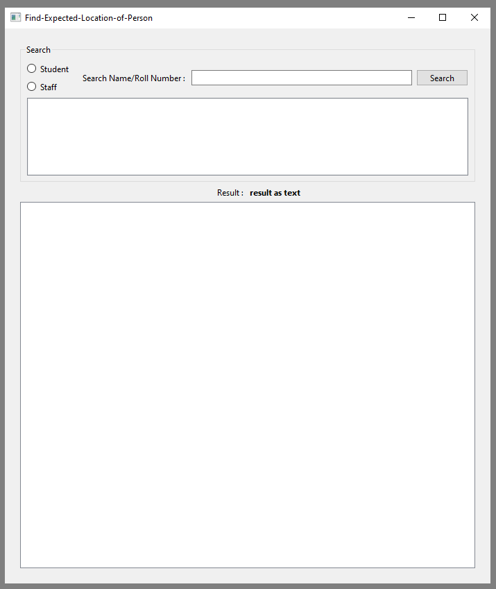

# Find-Expected-Location-of-Person

> [!NOTE]
> ✨find the person in previously maped primises
> with help of time table and plan of primises
>

### Input :
* time table (csv)

    rollno, name, class, branch, div, group

* capsul details (csv) 
    
    rollno, name, class, branch, div, group

* primises (png)

### Query Input :
* student :
    * student name 
    * roll no
* staff :
    * staff name
    * staff id

### Output :
* text result
* graphical result

 

### GUI :

